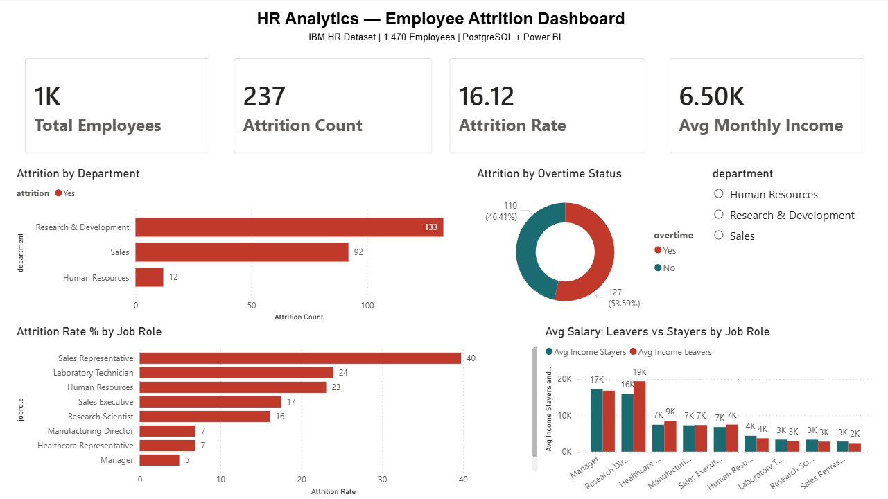
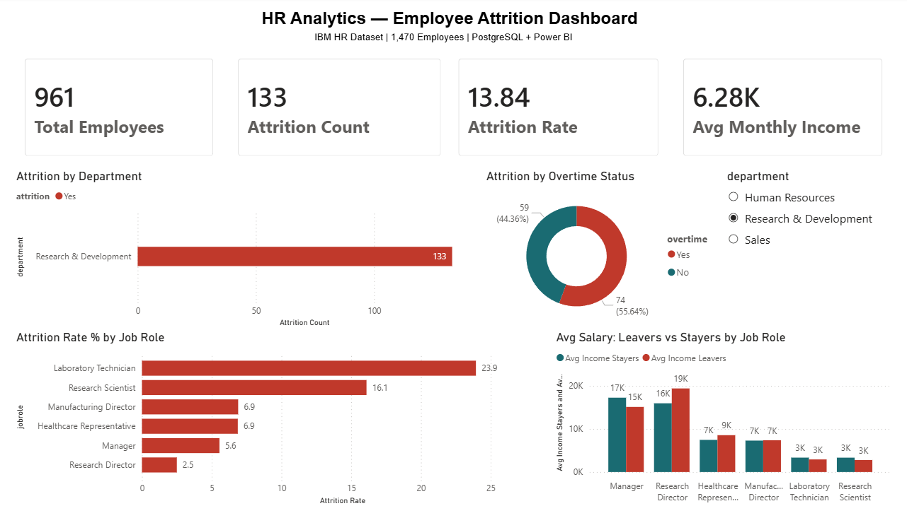
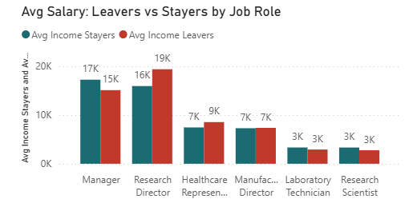

# HR Analytics — Employee Attrition Analysis


> An end-to-end data analytics project uncovering why employees leave, who is most at risk, and what HR can do about it.

---

## 📌 Project Overview

This project analyzes employee attrition patterns using the **IBM HR Analytics dataset** — 1,470 employees across 35 attributes. The goal is to give HR leadership a clear, data-backed picture of attrition drivers so they can act before the problem worsens.

**Business Problem:** The company is experiencing a **16.12% attrition rate**. HR leadership needs to understand *who* is leaving, *why*, and *which departments* are most at risk.

**Tools Used:**

| Tool | Purpose |
|---|---|
| 🐘 PostgreSQL | Data modeling + 7 advanced SQL queries |
| 📊 Power BI Desktop | Interactive 5-visual dashboard (live PostgreSQL connection) |
| 🐙 GitHub | Version control |

---

## 📊 Dashboard

Built with Power BI, connected live to PostgreSQL. Use the **department slicer** to filter all visuals simultaneously.

<div align="center">

| 🗂️ Overview | 🔬 Filtered: R&D | 💰 Salary Comparison |
|:---:|:---:|:---:|
|  |  |  |
| Full company view | R&D department drill-down | Leavers vs stayers pay gap |

</div>
---

## 🔍 Key Findings

| # | Finding | Insight |
|---|---|---|
| 1 | **Overall attrition: 16.12%** | 237 out of 1,470 employees left |
| 2 | **Sales Representatives: 39.76% attrition** | Highest-risk role in the company |
| 3 | **R&D loses the most people (133)** | Despite a lower attrition %, sheer volume is alarming |
| 4 | **Junior leavers are underpaid vs. peers** | Sales Rep, Lab Tech, HR — all show pay inequity |
| 5 | **Senior leavers earn MORE than stayers** | Money isn't the issue at senior level — culture and growth are |
| 6 | **Low JobSat + Low EnvSat = 37.74% attrition** | Worst-performing combination in the satisfaction matrix |
| 7 | **44% of R&D leavers worked overtime** | Overwork + low pay = attrition in junior R&D roles |
| 8 | **Research Directors: only 2.5% attrition** | Benchmark role for retention best practices |

---

## 🗂️ Project Structure

```
hr-analytics/
├── sql/
│   ├── 00_create_table.sql         # Schema creation
│   ├── 00_data_validation.sql      # Data quality checks
│   ├── 01_attrition_by_dept.sql    # Dept-level attrition
│   ├── 02_salary_band_analysis.sql # Income vs attrition
│   ├── 03_window_functions.sql     # RANK, LAG, NTILE
│   ├── 04_cte_pipeline.sql         # Multi-step CTE analysis
│   ├── 05_tenure_analysis.sql      # LAG + YoY patterns
│   ├── 06_satisfaction_matrix.sql  # FILTER aggregates
│   └── 07_executive_summary.sql    # Final 4-step CTE report
├── dashboard/
│   ├── hr_analytics_dashboard.pbix
│   └── screenshots/
│       ├── dashboard_overview.jpg
│       ├── dashboard_filtered_RD.jpg
│       └── salary_comparison.jpg
├── data/                            # Source dataset
├── .gitignore
└── README.md
```

---

## 🧠 SQL Concepts Demonstrated

| Concept | Query File | Business Question Answered |
|---|---|---|
| `GROUP BY` + `HAVING` | `01_attrition_by_dept.sql` | Which departments have >15% attrition? |
| `CASE WHEN` + salary bands | `02_salary_band_analysis.sql` | Do lower-paid employees leave more? |
| `RANK() OVER` + `AVG() OVER` | `03_window_functions.sql` | How does each role rank within its department? |
| `NTILE()` + CTE | `04_cte_pipeline.sql` | Which salary quartile has the most exits? |
| `LAG() OVER` | `05_tenure_analysis.sql` | At what tenure stage does attrition peak? |
| `FILTER` aggregates | `06_satisfaction_matrix.sql` | Which satisfaction combination is most critical? |
| 4-step CTE pipeline | `07_executive_summary.sql` | Full executive attrition report |

---

## 📈 DAX Measures (Power BI)

```dax
Total Employees    = COUNT('public hr_employee'[employeenumber])
Attrition Count    = COUNTROWS(FILTER('public hr_employee', [attrition] = "Yes"))
Attrition Rate     = DIVIDE([Attrition Count], [Total Employees]) * 100
Avg Income Leavers = CALCULATE(AVERAGE([monthlyincome]), [attrition] = "Yes")
Avg Income Stayers = CALCULATE(AVERAGE([monthlyincome]), [attrition] = "No")
```

---

## 💡 Recommendations for HR Leadership

1. **Immediate — Pay Equity Audit:** Sales Representatives and Lab Technicians who leave are earning less than peers who stay. Closing this gap is the fastest lever.
2. **Short-term — Overtime Policy in R&D:** 44% of R&D leavers were working overtime. Add overtime compensation or cap hours for junior R&D roles.
3. **Long-term — Career Path Clarity:** Research Scientists and Lab Technicians are leaving due to stagnation. Structured growth tracks can reduce this.
4. **Benchmark — Research Directors:** With only 2.5% attrition, this role is a model for retention. Study what's working there and replicate it across other senior roles.

---

## 🚀 How to Run This Project

### PostgreSQL Setup

```sql
CREATE DATABASE hr_analytics;
```

Then run the SQL files in order:

```bash
# 1. Create schema
psql -d hr_analytics -f sql/00_create_table.sql

# 2. Import CSV
# Use pgAdmin or \copy to load: data/WA_Fn-UseC_-HR-Employee-Attrition.csv

# 3. Validate data
psql -d hr_analytics -f sql/00_data_validation.sql

# 4. Run analysis queries (01 through 07)
```

### Power BI

1. Open `dashboard/hr_analytics_dashboard.pbix`
2. Go to **Transform Data → Data Source Settings**
3. Update the PostgreSQL server and credentials to match your local setup
4. Click **Refresh**

---

## 👤 Author

**[Mohammed Yousuf]**
BCA Final Year | Aspiring Data Analyst
📍 Bengaluru / Hyderabad

[](https://www.linkedin.com/in/mohammed-yousuf-aiml)
[](https://github.com/MohammedYousufCode)

---

*Dataset: [IBM HR Analytics Employee Attrition](https://www.kaggle.com/datasets/pavansubhasht/ibm-hr-analytics-attrition-dataset) via Kaggle*
